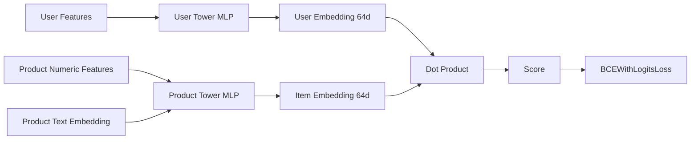

# Two-Tower Recommendation Architecture

```mermaid
flowchart LR
    A[User Features] --> B[User Tower MLP]
    C[Product Numeric Features] --> D[Product Tower MLP]
    E[Product Text Embedding] --> D
    B --> F[User Embedding 64d]
    D --> G[Item Embedding 64d]
    F --> H[Dot Product]
    G --> H
    H --> I[Score]
    I --> J[BCEWithLogitsLoss]
```
